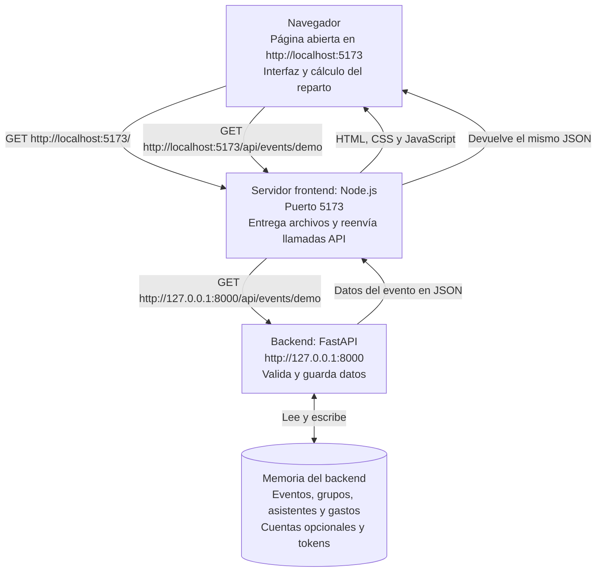
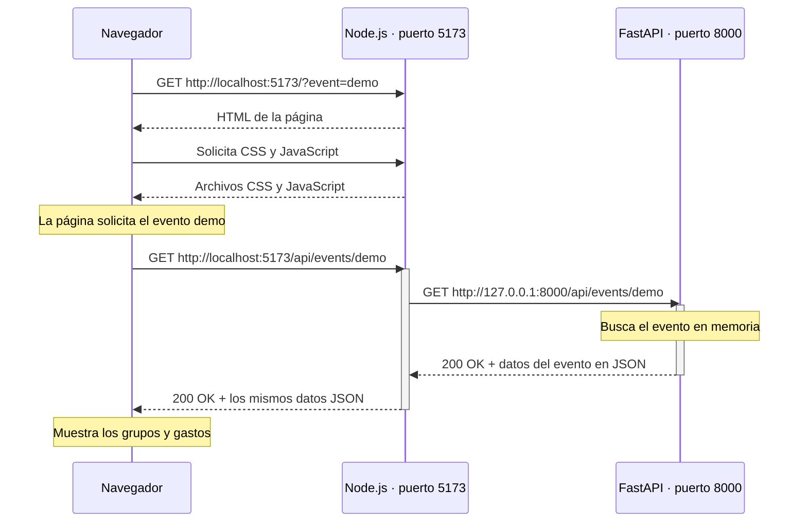

# Arquitectura de Chip In y sus URLs

## La idea principal

**El navegador habla con el puerto 5173. El servidor Node.js recibe esa petición y habla con FastAPI en el puerto 8000.**

Hay dos servidores y una página que se ejecuta en el navegador:

| Parte | Qué hace | Dirección predeterminada |
| --- | --- | --- |
| Página en el navegador | Muestra la interfaz, envía solicitudes y calcula el reparto | Se abre en `http://localhost:5173` |
| Servidor del frontend (Node.js) | Entrega HTML, CSS y JavaScript; reenvía las solicitudes `/api/...` | `http://localhost:5173` |
| Backend (FastAPI) | Valida solicitudes y guarda eventos, grupos y gastos | `http://127.0.0.1:8000` |

El **frontend** tiene dos partes: el JavaScript que se ejecuta en el navegador y el servidor Node.js que entrega los archivos. Esa distinción explica por qué aparecen dos URLs al hablar de las llamadas al backend.

## Diagrama de arquitectura



Si tu visor no muestra Mermaid, el recorrido es:

```text
Navegador                     Servidor frontend               Backend
                              Node.js                         FastAPI

GET localhost:5173/api/... --> puerto 5173
                              reenvía la petición ----------> 127.0.0.1:8000/api/...
                              <------------------------------ respuesta JSON
<---------------------------- devuelve la respuesta
```

## Diagrama de secuencia

Este diagrama tipo escalera se lee de arriba hacia abajo. Node.js actúa como intermediario: recibe la petición del navegador y la reenvía a FastAPI.



Las flechas continuas representan peticiones y las punteadas representan respuestas. Node.js no se llama a sí mismo ni redirige el navegador a otra URL: hace una petición a FastAPI y devuelve su respuesta al navegador.

## Ejemplo: abrir el evento de demostración

1. Abres **http://localhost:5173/?event=demo**. Esta es la URL de la página.
2. El JavaScript de la página lee `event=demo` y llama a `api.getEvent('demo')`.
3. El cliente HTTP solicita **`/api/events/demo`**. Como no incluye un servidor completo, el navegador usa la dirección de la página y forma **http://localhost:5173/api/events/demo**.
4. Node.js recibe la solicitud en el puerto **5173**. Al reconocer el prefijo `/api/`, la reenvía a **http://127.0.0.1:8000/api/events/demo**.
5. FastAPI busca el evento `demo` en su memoria y devuelve sus datos en JSON.
6. Node.js devuelve ese JSON al navegador. La página muestra los grupos y gastos, y calcula el reparto.

**Por eso hay dos respuestas a “¿qué URL usa?”:**

- Desde el **navegador**: `http://localhost:5173/api/...`.
- Desde el **servidor Node.js hacia FastAPI**: `http://127.0.0.1:8000/api/...`.

Node.js actúa como **proxy**, que aquí significa intermediario que reenvía solicitudes y respuestas.

## Qué significa «mismo origen»

Un origen combina **protocolo + nombre del servidor + puerto**.

En `http://localhost:5173`, esos componentes son `http`, `localhost` y `5173`.

La página `http://localhost:5173/` y la solicitud `http://localhost:5173/api/events/demo` tienen el mismo origen porque esos tres componentes coinciden. Sus rutas son distintas, pero el origen es el mismo.

`http://127.0.0.1:8000` es otro origen. Aunque `localhost` y `127.0.0.1` apuntan a la propia computadora en este entorno local, el navegador distingue el nombre y el puerto de cada dirección.

## URLs de las operaciones actuales

| Operación | Método | URL solicitada por el navegador | Destino al que Node.js la reenvía |
| --- | --- | --- | --- |
| Crear evento | POST | `http://localhost:5173/api/events` | `http://127.0.0.1:8000/api/events` |
| Crear una copia del ejemplo | POST | `http://localhost:5173/api/events/demo` | `http://127.0.0.1:8000/api/events/demo` |
| Consultar evento | GET | `http://localhost:5173/api/events/{id}` | `http://127.0.0.1:8000/api/events/{id}` |
| Agregar grupo y asistentes | POST | `http://localhost:5173/api/events/{id}/groups` | `http://127.0.0.1:8000/api/events/{id}/groups` |
| Agregar gasto | POST | `http://localhost:5173/api/events/{id}/expenses` | `http://127.0.0.1:8000/api/events/{id}/expenses` |

`{id}` se sustituye por el identificador del evento. Para consultar el evento precargado, es `demo`.

Estas cinco operaciones son públicas. El backend también ofrece registro y login opcionales en `/api/auth/register` y `/api/auth/login`. Solo `/api/auth/me` requiere un token bearer. La interfaz actual no tiene un flujo de login.

La documentación interactiva de FastAPI se abre directamente en **http://127.0.0.1:8000/docs**.

## Cómo arrancar y configurar las direcciones

Desde `week2/`, en dos terminales:

```bash
# Terminal 1: inicia FastAPI en el puerto 8000
make run
```

```bash
# Terminal 2: inicia Node.js en el puerto 5173
make frontend
```

Después abre **http://localhost:5173/?event=demo**.

Para cambiar el backend al puerto 8001:

```bash
# Terminal 1
make run BACKEND_PORT=8001
```

```bash
# Terminal 2: indica al proxy dónde encontrar el backend
make frontend BACKEND_URL=http://127.0.0.1:8001
```

El navegador sigue solicitando `http://localhost:5173/api/...`. Solo cambia el destino al que Node.js reenvía la petición.

## Dónde está definido en el código

- [Cliente HTTP del navegador](../frontend/src/api.js): usa `/api` como ruta base.
- [Servidor Node.js y proxy](../frontend/server.js): reenvía `/api/...` a `BACKEND_URL`, cuyo valor predeterminado es `http://127.0.0.1:8000`.
- [Aplicación FastAPI](../backend/app/main.py): configura el backend y sus routers.
- [Almacenamiento](../backend/app/store.py): guarda y precarga los eventos en memoria.
- [Makefile](../Makefile): define los comandos y puertos de desarrollo.

## Duración de los datos y enlaces compartidos

Los datos viven en la memoria del backend: **se borran al reiniciarlo** y vuelve a crearse el ejemplo inicial. La aplicación todavía no usa una base de datos persistente.

Un enlace compartido permite consultar el mismo evento desde otro navegador mientras este pueda alcanzar el servidor frontend. En otro dispositivo, `localhost` apunta a ese otro dispositivo; para acceder al servidor debes usar una dirección de la computadora que lo ejecuta y que sea accesible desde la red.
